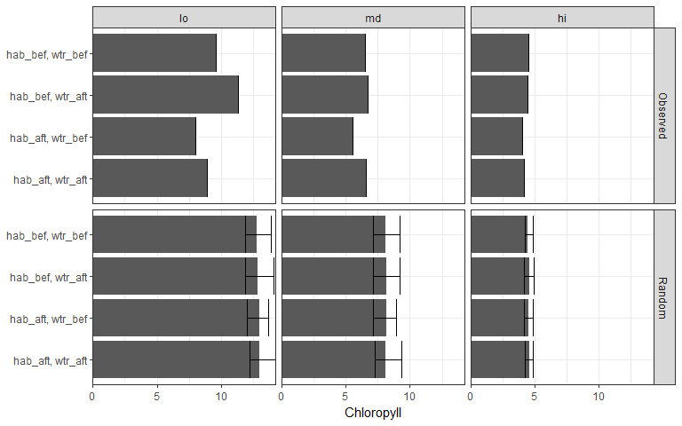

```r
knitr::opts_chunk$set(message = F, warning = F)

library(tidyverse)
library(ggmap)
library(lubridate)
library(geosphere)
library(stringi)
library(tibble)
library(raster)
library(sp)
library(rgdal)
library(foreach)
library(doParallel)

data(restdat)
data(reststat)
data(wqdat)
data(wqstat)
data(tbpoly)

# source R files
source('R/get_chg.R')
source('R/get_clo.R')
source('R/get_cdt.R')
source('R/get_brk.R')

# Set parameters, yr half-window for matching, mtch is number of closest matches
yrdf <- 5
mtch <- 10

# total random sites to create
tot <- nrow(restdat)

# random id, date range, spatial extent
id <- stri_rand_strings(tot, 5)
dts <- range(restdat$date)
ext <- bbox(tbpoly)

# number of random iterations
n <- 50
```


```r
# setup parallel
ncores <- detectCores() - 1
registerDoParallel(cores = ncores)
strt <- Sys.time()

# run
outall2 <- foreach(i = 1:n, .packages = c('tidyr', 'dplyr', 'raster', 'sp', 'rgeos', 'tibble', 'rgdal', 'purrr', 'geosphere')) %dopar% {
  
  cat(i, '\t')
  
  sink('log.txt')
  cat('Log entry time', as.character(Sys.time()), '\n')
  cat(i, ' of ', n, '\n')
  print(Sys.time() - strt)
  sink()
  
  lon <- rnorm(10 * tot, mean(reststat$lon), sd(reststat$lon))
  lat <- rnorm(10 * tot, mean(reststat$lat), sd(reststat$lat))
  tmp <- SpatialPoints(cbind(lon, lat), 
                       proj4string = crs(tbpoly)
  ) %>% 
    .[tbpoly, ] %>% 
    .[sample(1:nrow(.@coords), tot, replace = F), ]
  
  restdat_rnd <- tibble(id) %>% 
    mutate(
      date = sample(seq(dts[1], dts[2]), tot, replace = T),
      top = sample(c('hab', 'wtr'), tot, replace = T)    
    )
  
  reststat_rnd <- tibble(id) %>% 
    mutate(
      lat = tmp$lat, 
      lon = tmp$lon
    )
  
  resgrp <- 'top'
  restall_rnd <- left_join(restdat_rnd, reststat_rnd, by = 'id')
  names(restall_rnd)[names(restall_rnd) %in% resgrp] <- 'Restoration\ngroup'
  
  ## Distance to restoration sites
  wqmtch_rnd <- get_clo(restdat_rnd, reststat_rnd, wqstat, resgrp = 'top', mtch = mtch)
  
  ## Summarizing effects of restoration projects on salinity
  salchg_rnd <- get_chg(wqdat, wqmtch_rnd, statdat, restdat_rnd, wqvar = 'sal', yrdf = yrdf)
  
  ## Summarizing effects of restoration projects on chlorophyll
  chlchg_rnd <- get_chg(wqdat, wqmtch_rnd, statdat, restdat_rnd, wqvar = 'chla', yrdf = yrdf)
  
  # Get conditional probability distributions for the restoration type on salinity 
  wqcdt_rnd <- get_cdt(salchg_rnd, 'hab', 'wtr')
  
  # Discretization of salinity conditional probability distributions: 
  salbrk_rnd <- get_brk(wqcdt_rnd, qts = c(0.33, 0.66), 'hab', 'wtr')
  
  # merge with salinity, bet salinity levels
  salbrk_rnd <- salbrk_rnd %>% 
    group_by(hab, wtr) %>% 
    nest(.key = 'levs')
  allchg_rnd <- full_join(chlchg_rnd, salchg_rnd, by = c('hab', 'wtr', 'stat')) %>% 
    rename(
      salev = cval.y, 
      cval = cval.x
    ) %>% 
    group_by(hab, wtr) %>% 
    nest %>% 
    left_join(salbrk_rnd, by = c('hab', 'wtr')) %>% 
    mutate(
      sallev = pmap(list(data, levs), function(data, levs){
        # browser()
        out <- data %>% 
          mutate(
            saval = salev,
            salev = cut(salev, breaks = c(-Inf, levs$qts, Inf), labels = c('lo', 'md', 'hi')),
            salev = as.character(salev)
          )
        
        return(out)
        
      })
    ) %>% 
    dplyr::select(-data, -levs) %>% 
    unnest
  
  out <- allchg_rnd %>% 
    group_by(hab, wtr, salev) %>% 
    summarize(cval = mean(cval))
  
  out
  
}

save(outall2, file = 'data/outall2.RData', compress = 'xz')
```


```r
# observed and randomized results
data(allchg)
data(outall2)

# summarize observed
toplo1 <- allchg %>% 
  group_by(hab, wtr, salev) %>% 
  summarise(
    chvalmd = median(chval, na.rm = T),
    chvallo = chvalmd, 
    chvalhi = chvalmd
  ) %>% 
  unite('rest', hab, wtr, sep = ', ') %>% 
  mutate(
    salev = factor(salev, levels = c('lo', 'md', 'hi')), 
    dat = 'Observed'
  )

# summarize random
toplo2 <- outall2 %>% 
  enframe('iter') %>% 
  unnest %>% 
  group_by(hab, wtr, salev) %>% 
  summarise(
    chvalmd = median(cval, na.rm = T), #t.test(cval, na.rm = T)$estimate,
    chvallo = quantile(cval, probs = 0.05, na.rm = T), # t.test(cval, na.rm = T),$conf.int[1],
    chvalhi = quantile(cval, probs = 0.95, na.rm = T) #t.test(cval, na.rm = T),$conf.int[2]
  ) %>% 
  ungroup %>% 
  unite('rest', hab, wtr, sep = ', ') %>% 
  mutate(
    salev = factor(salev, levels = c('lo', 'md', 'hi')),
    dat = 'Random'
  ) 

# combine
toplo <- rbind(toplo1, toplo2)

# plot
ggplot(toplo, aes(x = rest, y = chvalmd)) + 
  theme_bw() + 
  theme(
    axis.title.y = element_blank()
  ) +
  geom_bar(stat = 'identity') + 
  geom_errorbar(aes(ymin = chvallo, ymax = chvalhi)) + 
  facet_grid(dat ~ salev) + 
  coord_flip() +
  scale_y_continuous('Chloropyll', expand = c(0, 0))
```

<!-- -->
